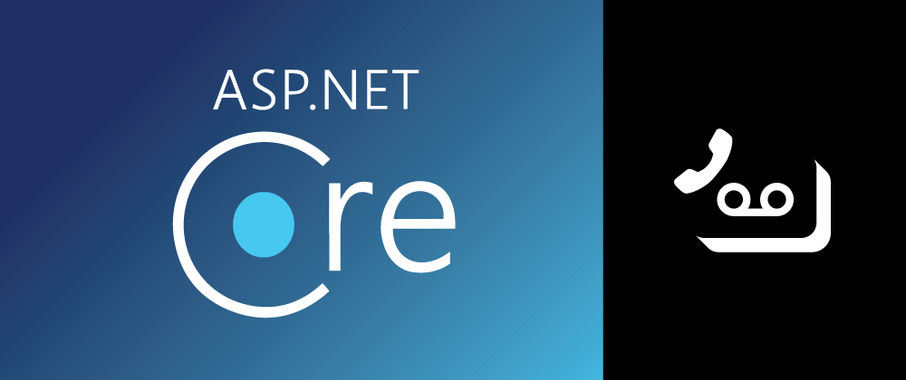

You can build extremely powerful and flexible contact center solutions with the Vonage Voice API. But what happens if there's no one there to answer the phone on the other end? Well, I suppose you could just simply let the phone ring or play a message back asking them to call again later. Probably what most people would do, including myself, is to take the customer's message in the form of a voicemail. With the [Vonage Voice API](https://developer.nexmo.com/voice/voice-api/overview) and our [.NET SDK](https://www.nuget.org/packages/Nexmo.Csharp.Client/), this is a snap to do in [ASP.NET Core](https://docs.microsoft.com/en-us/aspnet/core/?view=aspnetcore-3.1)!

## Overview

There are multiple ways to record phone calls with the Vonage Voice API. In this tutorial, we will be using an Answer webhook, which will return a Nexmo Call Control Object(NCCO) containing an action telling Vonage to record the call and then post back the recording's URL to our server when the call concludes. A webhook is simply a publicly available HTTP endpoint that Vonage will reach out to for instructions when it gets a call.

## Jump Right to the Code

If you would like to skip this tutorial and just look at the code, you can find all the code for this tutorial in [GitHub](https://github.com/nexmo-community/voicemail-aspnet-core).

## Prerequisites

* We'll be testing this with [ngrok](https://ngrok.com/). Go ahead and follow their instructions for setting it up.
* We're going to need [npm](https://www.npmjs.com/) to fetch the nexmo-cli
* We're going to need the latest .NET Core SDK. I'm using version 3.1 in this tutorial. 
* We're going to use Visual Studio for this tutorial. Of course, this will also work with Visual Studio Code and Visual Studio for Mac. There may just be some slightly different steps for setup and running.

## Vonage API Account
To complete this tutorial, you will need a [Vonage API account](http://developer.nexmo.com/ed?c=blog_text&ct=2020-08-10-how-to-build-a-voicemail-app-with-asp-net-core-dr). If you don’t have one already, you can [sign up today](http://developer.nexmo.com/ed?c=blog_text&ct=2020-08-10-how-to-build-a-voicemail-app-with-asp-net-core-dr) and start building with free credit. Once you have an account, you can find your API Key and API Secret at the top of the [Vonage API Dashboard](http://developer.nexmo.com/ed?c=blog_text&ct=2020-08-10-how-to-build-a-voicemail-app-with-asp-net-core-dr).

<a href="http://developer.nexmo.com/ed?c=blog_banner&ct=2020-08-10-how-to-build-a-voicemail-app-with-asp-net-core-dr"></a>

## Setup the Nexmo CLI

With npm installed we can go ahead and install and configure the Nexmo CLI using:

```sh
npm install nexmo-cli -g
nexmo setup API_KEY API_SECRET
```

Running this will get the Nexmo CLI setup and ready to run.

## Run Ngrok

I'm going to be throwing everything on `localhost:5000`. Running ngrok will allow us to publicly access `localhost:5000`.

```sh
ngrok http --host-header=localhost:5000 5000
```

Take a note of the URL that ngrok is running on. In my case, it's running on `http://7ca005ad1287.ngrok.io`. This URL is going to be the base URL for my webhooks going forward.

## Create Our Vonage Application

A Vonage Application is a construct that enables us to link route our numbers and webhooks easily. You can create an application in the [Vonage Dashboard](https://dashboard.nexmo.com/applications), or you can just make it now with the CLI.

```sh
nexmo app:create "AspNetTestApp" http://7ca005ad1287.ngrok.io/webhooks/answer http://7ca005ad1287.ngrok.io/webhooks/events
```

These commands are going to create a Vonage Application. It's going to then link all incoming calls to that application to the answer URL: `http://7ca005ad1287.ngrok.io/webhooks/answer` and route all call events that happen on that application to `http://7ca005ad1287.ngrok.io/webhooks/events`. This command is going to print out two things:

1. Your application ID. You can find your application ID in the [Vonage Dashboard](https://dashboard.nexmo.com/applications) 
2. Your application's private key. Make sure you take this and save this to a file—I'm calling mine `private.key`

### Link your Vonage Number to Your Application

When you create your account, you are assigned a Vonage number. You can see this in the [numbers section of the dashboard.](https://dashboard.nexmo.com/your-numbers) Or you could alternatively just run `nexmo number:list` in your console to list your numbers. Take your Vonage Number and your Application ID and run the following:

```sh
nexmo link:app VONAGE_NUMBER APPLICATION_ID
```

With this done, your calls are going to route nicely to your URL.

## Create Your Project

To create your project:

* Open Visual Studio
* Click Create a New Project
* Select ASP.NET Core Web Application
* Click Next
* Name your project VonageVoicemail
* Click Create
* Select API
* Click Create

## Install Dependencies

The only dependency this is going to have is the `Nexmo.Csharp.Client` NuGet package. Go ahead and grab that using your preferred method. Mine is to navigate to the `VonageVoicemail.csproj`'s directory and run:

```bash
dotnet add package Nexmo.Csharp.Client
```

## Create the Controller

If you're feeling lazy, you could piggyback off the `WeatherForecastController` that's pre-generated. But for our purposes we'll create a new controller by right-clicking on the `Controllers` folder -> Add -> Controller -> Select `API Controller - Empty` -> click Add -> Name this `VoiceController`.

These steps will create an empty API controller.

### Dependency Inject Configuration

We'll need access to the app's configuration for this. In the VoiceController, declare an IConfiguration object, and then dependency injects an IConfiguration into the controller's constructor.

```csharp
private readonly IConfiguration _config;

public VoiceController(IConfiguration config)
{
    _config = config;
}
```

### Add Answer Route

Now that we have our API controller built, let's add an answer route. We'll add an `Answer` method at the end of this route, which will create an NCCO with two actions:

1. It will speak to the user, telling them that you're currently indisposed.
2. A record action that will end after 3 seconds of silence, beep before starting to record, and elicit a POST request at the end of the call containing the recording information.

```csharp
[HttpGet]
[Route("webhooks/answer")]
public async Task<string> Answer()
{
   var host = Request.Host.ToString();
   //remove the next line if using ngrok without --host-header option
   host = Request.Headers["X-Original-Host"];
   var sitebase = $"{Request.Scheme}://{host}";

   var talkAction = new TalkAction
   {
       Text = "Hello, you have reached Steve's number," +
       " he cannot come to the phone right now. " +
       "Please leave a message after the tone.",
       VoiceName = "Joey"
   };

   var recordAction = new RecordAction
   {
       EndOnSilence = "3",
       BeepStart = "true",
       EventUrl = new[] { $"{sitebase}/webhooks/recording" },
       EventMethod = "POST"
   };

   var ncco = new Ncco(talkAction, recordAction);
   return ncco.ToString();
}
```

> Important: `host = Request.Headers["X-Original-Host"];` allows you to get the appropriate callback URL when using ngrok with the `-host-header` option. Remove this if you're not using it.

### Add Post-Recording Route

After recording the call, Vonage will post a response back to you on the `EventUrl` you provided. From that POST request, we will extract the Recording URL. Then we'll create a voice client from our credentials, which we'll store in the configuration. With the voice client, we will get the recording, and then save it to an mp3 file on our disk.

```csharp
[HttpPost]
[Route("webhooks/recording")]
public IActionResult Recording()
{
   Record record;
   var appId = _config["APP_ID"];
   var privateKeyPath = _config["PRIVATE_KEY_PATH"];
   var credentials = Credentials.FromAppIdAndPrivateKeyPath(appId, privateKeyPath);
   var voiceClient = new VoiceClient(credentials);
   using (StreamReader reader = new StreamReader(Request.Body, Encoding.UTF8))
   {
       record = JsonConvert.DeserializeObject<Record>(reader.ReadToEndAsync().Result);
       var recording = voiceClient.GetRecording(record.RecordingUrl);
       System.IO.File.WriteAllBytes("your_recording.mp3", recording.ResultStream);
   }

   Console.WriteLine($"Record event received on webhook - URL: {record?.RecordingUrl}");
   return StatusCode(204);
}
```

That's all the C# code you're going to need for this. Next, let's go ahead and configure the app!

## Configure the App

There are two types of configuration we'll need to perform.

1. Add the configuration keys for APP_ID and PRIVATE_KEY_PATH to the appsettings.json file
2. Update the configuration settings in launchsettings.json to have kestrel/IIS express listen on `http://localhost:5000`

### Add Configuration Keys

Open `appsettings.json` and add the keys `APP_ID` and `PRIVATE_KEY_PATH` to it, utilizing the application Id and the Private key that we generated with the CLI earlier. Those keys in JSON will look like:

```json
"APP_ID": "7h15-w111-83-y0u2-4pp-1d",
"PRIVATE_KEY_PATH": "C:\\path\\to\\your\\private.key"
```

### Update launchSettings.json

Now we need to update the launch settings file to have IIS Express or Kestrel listen on `http://localhost:5000`. Open `properties/launchSettings.json`; if you are using IIS Express, change the application URL in the iisSettings object to `http://localhost:5000` and set the sslPort to 0 to disable SSL. If you are using Kestrel, remove the `https://localhost:5001` endpoint leaving only the `http://localhost:5000` endpoint.

## Test

That's all we need to do before running the app. You can run the app from Visual Studio by pressing F5, or from the command line by running `dotnet run`. If you call your Vonage API number, it will play the outgoing message, record the caller after the beep, and then when the call concludes, save a recording of the call to your disk.

## Resources

* The code for this tutorial is located in [GitHub](https://github.com/nexmo-community/voicemail-aspnet-core).