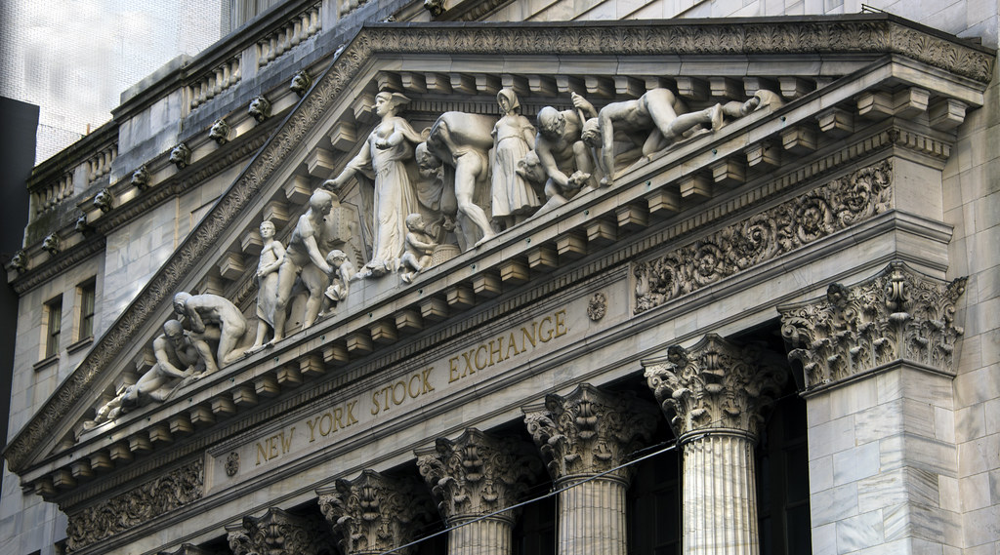

If you've ever watched CNBC, Bloomberg TV, or even just watched Yahoo Finance in the United States, you'll notice something every weekday between 9:30 AM and 4:00 PM Eastern Standard Time. You'll see a bunch of random-seeming letters, e.g. `S&P 500` or `DOW 30` or `Nasdaq` along with a bunch of red and green numbers on the screen continually updating. This post is going to explain how those numbers are determined and why they update so sporadically.

## Symbols and Types of Stocks

### The Big Three

Let's take a step back first and talk about those letters first. If you're looking at the front page of Yahoo Finance, the big three, you'll always see are `S&P 500`, `DOW 30`, and `Nasdaq.`


The first thing you need to understand is that those are not stocks or securities; they are composite indexes meant to give you a general sense of where the market is. The DOW 30 is an index that looks at the 30 premier "Blue Chip" US Stocks. These are the big 30, you might say, these are your Exxons, Coca-Colas, Apples. These elite stocks have substantial Market Caps (total value of the outstanding stock) and have a long track record of success and a reasonably stable portfolio. The S&P 500 is an index of 500 prestigious American Companies - these are companies that are worth more than \$8.2 Billion Dollars and have generally been profitable, and are often traded and thus quite liquid. The Nasdaq is shorthand for the Nasdaq Composite, an index of all the stocks traded on the NASDAQ exchange.

These are the indicators you see, they are a top-line view of where the market is, but they are calculated from a composite of a bunch of securities underneath them. We're going to be focusing predominantly on those securities traded underneath the primary indices.

### Types of Securities

When you are thinking about stock markets, there are four types of securities you can generally think about purchasing.

1. Stocks
2. Exchange-Traded Funds(ETFs)
3. Mutual Funds
4. Hedge Funds

#### Stocks

Stocks are an ownership stake in a particular company. They tend to go up when the company does well and go down when a company does poorly. They also get paid out dividends, if a company is in a position to pay out dividends, and they even have the right to [Proxy Vote](https://en.wikipedia.org/wiki/Proxy_voting) if a company's by-laws allow it. When a CEO is said to be "working for their shareholders." They are referring to anybody who owns these stocks.

They are the base type of security on the market. You can trade stocks whenever the market is open by placing an order, which we'll talk about soon. Because of this, they are generally considered highly liquid. Meaning you can pull cash out of them right away. Especially if they are in one of the indexes we spoke to earlier, as a stipulation of those indices is that there needs to be a fair amount of _volume_, the amount of particular security traded on a specific day. The symbol for a stock will generally be 1-4 letters; for example, **T** is AT&T, and **TSLA** is Tesla.

#### ETFs

Exchange-Traded Funds are funds that are similar to our stock market indicators; they are a composite of a bunch of different stocks bought and sold together. Like stocks, they can be traded on the exchange and are seen as highly liquid.

ETFs are a type of managed Fund. Fund managers who manage the Fund. The Fund compensates fund managers with fees. ETFs generally track a particular index, like the S&P 500, so they are usually low-touch and low overhead. The Fund usually pays the fund managers between .1%-1% of Assets Under Management (AUM). The Symbols for ETFs are generally 3 or 4 letters, e.g., **SPY** is the canonical ETF as it's tacked directly to the S&P 500.

#### Mutual Funds

Mutual Funds are another type of Fund, but rather than tracking a particular index, they generally have a trading strategy and a theory about how the market works and how to maximize returns for their investors. Because of this, the fund managers are generally paid a bit more, usually between 1% and 3% of AUM. Another significant distinction of a Mutual Fund versus an ETF is that Mutual Funds do not trade on an exchange. Mutual Funds trade at the end of the day, and it's challenging to get visibility as to what the price will be ahead of time. Mutual Funds are less liquid than ETFs. Consequentially, we won't be talking about them too much. Mutual Funds generally have five letter symbols, e.g., **FXAIX** is a mutual fund equivalent of **SPY**

#### Hedge Funds

Peasants like us generally don't have to think about these types of funds. They are similar to Mutual Funds in that they have their strategies for trading and their theories of the case. They build extremely sophisticated models and have the expensive, best-in-class infrastructure to exploit arbitrages in the market wherever they can find them to maximize returns for investors. Mutual funds typically only accept massive investments, usually in the millions of dollars, so they are generally invested only by very wealthy people or large trusts e.g., pension funds. The terms of a Hedge Fund do not allow you to buy/sell at will, so you can only withdraw money from a fund with the Fund's agreement. If you've seen *the Big Short*, Michael Burry(Christian Bale), and Mark Baum(Steve Carell) were Hedge Fund managers. Hedge Funds compensate their managers with a one-and-ten scheme where they get 1% of AUM and 10% of profits, though this varies from Fund to fund.

### What We'll Be Focusing On

All of these assets are dependant on the Order Book, but only two of them, ETFs and Stocks are directly traded on that book, so we'll be looking at that.

## The Order Book

Let's go back to our visualization of Yahoo Finance on a weekday afternoon. People will tell you that those numbers are how much that stock is worth. But how is that decided? "Well, the market decides!" Some libertarian friends of yours might tell you. That is not wrong ethereally, practically speaking; however, it's the Order Book that decides.

The Order Book is an electronic record of all the orders a particular stock exchange receives. A stock exchange is just a place where folks come together to buy and sell stocks. The New York Stock Exchange (NYSE) is perhaps the most prominent example, followed by the NASDAQ (the first electronic stock exchange). But there are stock exchanges all over the world. The Shanghai Stock Exchange, The London Stock Exchange, and The Japan Exchange Group are examples of stock exchanges. And they all operate off of this fundamental concept of an "Order Book." So let's talk a bit about how an order book works.

### What is an Order

Let's first think about what comprises an order. If you happen to have a brokerage account and have ever ordered a stock before you have probably seen something like this:


This picture is an order form - and this is what an order is. There are five components of an Order.

1. Buy or Sell - if you want to buy a security or sell it.
2. Symbol - the trading symbol you want to trade.
3. Number of Shares - the number of shares of a given symbol you want to trade.
4. Limit or market - the type of order - we'll get into this in a bit
5. Price - If it's a Limit order, the price you're willing to buy or sell.

An order that exchange gets is going to look something like:

```text
BUY TSLA 5 Market
```

or

```text
BUY TSLA 10 LIMIT 1541.00
```

or

```text
SELL TSLA 10 LIMIT 1542.00
```

#### Ask and Bid

The Order Book is just a set of pending orders. There is a constant contention between buyers and sellers in the market over the price of a particular security. If you'll recall from our order form earlier, there was an *Ask* and a *Bid*. The *Ask* is the lowest amount that someone is willing to sell a share for, and the *Bid* is the highest amount someone is willing to pay for a stock. The price we see is calculated with these values.

#### Limit vs Market

There are two types of orders, *Limit* and *Market*. Market orders are fulfilled at the market price. That price is the current Ask price if its a *BUY* order and the Bid price if it's a *SELL* order. Limit orders, on the other hand, are traded at threshold orders. If you have a Limit *BUY* order, the order is filled only when the Ask price is at or below the order's price. Conversely, if you have a Limit *SELL* order, the order will be fulfilled only when the Bid is at or above the price of the order.

### Order Book Example

You may have an order book for a particular stock - say Apple, for example, that looks like this:

```text
SELL APPL 100   LIMIT 386.50
SELL APPL 20    LIMIT 386.40
SELL APPL 100   LIMIT 386.30
SELL APPL 10    LIMIT 386.20

BUY  APPL 100   LIMIT 386.10
BUY  APPL 10000 LIMIT 386.00
BUY  APPL 50    LIMIT 385.90
BUY  APPL 10    LIMIT 385.80
```

In the case above, the value of Apple's stock is between its Ask price (387) and its Bid price(386). Now let's say we have two market orders come in.

```text
BUY  APPL 150 MARKET
SELL APPL 130 MARKET
```

Let's think about how this is going to work. The BUY order will be fulfilled at the market value so that BUY order will buy ten shares at \$386.20, 100 shares at \$386.30, 20 shares at \$386.40, and another 20 shares at \$386.50. So the order will come out to a total of \$57,950 and will average out to \$386.33 a share. The Sell order will be fulfilled at 100 shares at \$386.10, and 30 shares at \$386.00, coming to a total of \$50,190  for a per-share price of \$386.07. After those trades are fulfilled our book will look like this:

```text
SELL APPL 80   LIMIT 386.50

BUY  APPL 9970 LIMIT 386.00
BUY  APPL 50   LIMIT 385.90
BUY  APPL 10   LIMIT 385.80
```

### Pressure on the Market

The order book creates market pressure dynamics that drive the price of a stock up or down. In our previous example, there was a massive amount of *BUY* pressure on the exchange because there was an order looking to be fulfilled at 9970 shares. Thus any orders coming in would have to out-bid that giant *BUY* order to be fulfilled. Therefore the outlook on Apple's stock looking at the order book would be towards it increasing.

## Wrapping Up

Hopefully, you've found this explainer informative. I find the topic and nature of markets exciting. These mechanics are relatively easy to model, so I'd like to do so with some code in a future post!

## Attribution

The Cover art for this post:  "New York Stock Exchange" by Mal B is licensed under CC BY-ND 2.0. To view a copy of this license, visit https://creativecommons.org/licenses/by-nd/2.0/
