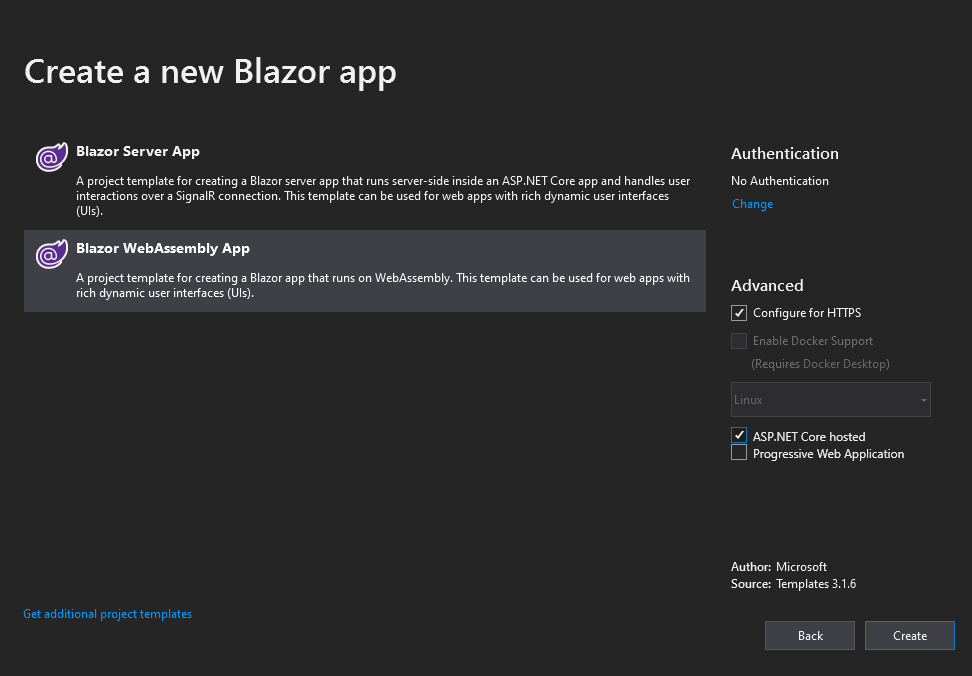
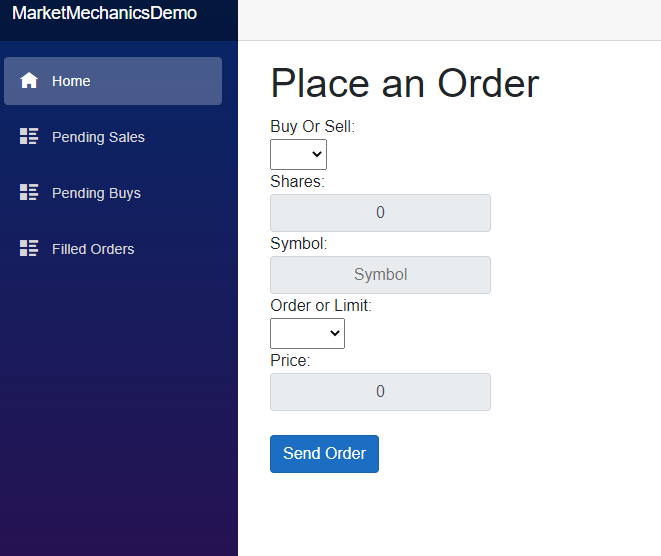
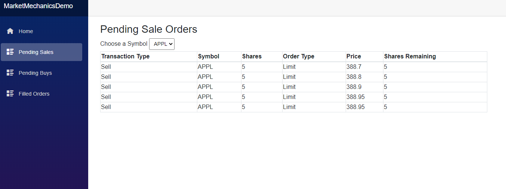
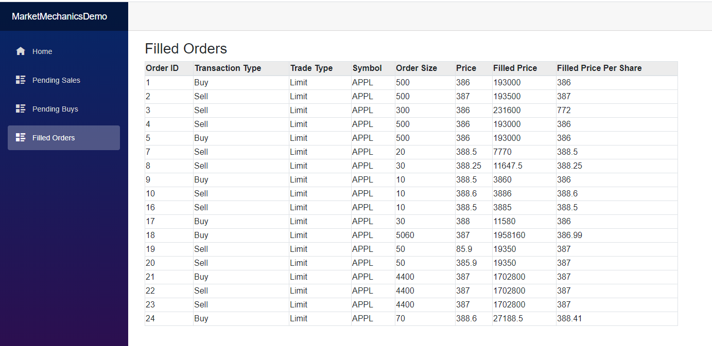

If you followed my previous post on the [Order Book and Basic Market Mechanics](/posts/basic-market-mechanics-the-order-book-explained), you're primed and pumped for this post. We're going to be building a market simulator that keeps track of the Order Book of a Stock Exchange. We'll do this with a combination of .NET technologies including Blazor WebAssembly, Entity Framework Core, and SignalR Core.

## Jump Right to the Code

Don't have time to run through the whole tutorial? That's fine, all the source code is available in [GitHub](https://github.com/slorello89/blazor-stock-exchange-simulator)

## Getting Started

Let's go ahead and Open Visual Studio, I'm using 2019 for this demo, click "Create a new project" -> Blazor App -> Give the Project a Name and click Create -> Select Blazor WebAssembly App and check the `ASP.NET Core hosted` and click Create:



## Add Dependencies

After Creating the app, there will be three separate projects.

* ProjectName.Client, the WebAssembly
* ProjectName.Server, your server code
* ProjectName.Shared, the shared code in your app

Add the following to each project, respectively, using your preferred means of installing NuGet packages.

### Client

* Microsoft.AspNetCore.SignalR.Client

### Shared

* System.ComponentModel.Annotations

### Server

* Microsoft.EntityFrameworkCore.Design
* Microsoft.EntityFrameworkCore.Sqlite (You can use any Entity database type you like)
* Newtonsoft.Json
* Microsoft.AspNetCore.SignalR.Core

## Build Our Model

We are going to write our model into our Shared project. Add the following cs files to your shared project.

* BuySell.cs
* LimitMarket.cs
* Order.cs

### Add BuySell Enum

If you'll recall from my previous post, there's two transaction types, Buys and Sells. We're going to represent that in our model in an Enum. Open `BuySell.cs` and convert its type to the following enum.

```csharp
public enum BuySell
{
    Buy = 1,
    Sell = 2
}
```

### Add LimitMarket Enum

Similarly, we need to add an enum representing whether the order type is a limit order or market order. Open `LimitMarket.cs` and change its type to the following.

```csharp
public enum LimitMarket
{
    Limit=1,
    Market=2
}
```

### Build the Order Class

As we've discussed, there are five components of a transaction:

1. **Transaction Type:** Buy/Sell
2. **Symbol:** The ordered security
3. **Shares:** The transacted number of shares
4. **Order Type:** Limit / Market - determining whether the order will have a threshold
5. **Price:** For Limit Orders, the threshold price

We're going to model this along with some other metadata in an Order Class:

```csharp
public class Order
{
    [Key]
    public int OrderId { get; set; }
    public BuySell BuyOrSell { get; set; }
    public LimitMarket LimitOrMarket { get; set; }
    public string Symbol { get; set; }
    public int NumSharesRemaining { get; set; }
    public int NumSharesInital { get; set; }
    public double Price { get; set; }
    public string TimePlaced { get; set; }
    public double FillPrice { get; set; }
}
```

### Create Database

With our data modeled we will move to the Server project. Add a class `OrderContext` to the Server Project. It will inherit `DbContext` from `Microsoft.EntityFrameworkCore`. Add a DbSet to contain our Orders, and override the config to use sqlite and use the database `OrderBook.db`.

```csharp
public class OrderContext : DbContext
{
    public DbSet<Order> Orders { get; set; }
    protected override void OnConfiguring(DbContextOptionsBuilder options)
    => options.UseSqlite("Data Source=OrderBook.db");
}
```

Now run the following in your console from within the server directory.

```bash
dotnet tool install --global dotnet-ef
dotnet ef migrations add InitialCreate
dotnet ef database update
```

> Note: I've seen the migrations uninstall packages from my project if that happens to you just reinstall them and run it again

This operation will output `OrderBook.db` in our server project's directory.

## Add OrderHub

We are going to use a single Hub to push everything down for us. In the server project, create a new Directory called `Hubs`and add an `OrderHub` class. Declare the `OrderHub` class as public and have it extend the `Hub` class from SignalR:

```csharp
public class OrderHub : Hub{}
```

## Configure Middleware

Now that we have our database and our hub, we need to configure the middleware for our app. In the server project open `startup.cs`, in the `ConfigureServices` method add SignalR and the DbContext:

```csharp
services.AddSignalR();
services.AddDbContext<OrderContext>();
```

Next, in the `UseEndpoints` delegate in the `Configure` method, map the hubs path.

```csharp
app.UseEndpoints(endpoints =>
{
    endpoints.MapRazorPages();
    endpoints.MapControllers();
    endpoints.MapFallbackToFile("index.html");
    endpoints.MapHub<OrderHub>("/orderhub"); //Add this line
});
```

## Build our Controller

Next, we're going to build the controller for our server; this will manage the book for us. Right Click on `Controllers` -> add -> Controller. Add an Empty API controller and call it `OrderController`. Delete any route information that comes as boilerplate - your class deceleration should look like:

```csharp
[ApiController]
public class OrderController : ControllerBase
```

### Dependency Injection and Construct Controller

We're going to need access to our Database and our Order Hub in this controller so let's go ahead and inject them into the constructor:

```csharp
private readonly OrderContext _orderContext;
private readonly IHubContext<Hubs.OrderHub> _hubContext;

public OrderController(OrderContext orderContext, IHubContext<Hubs.OrderHub> hubContext)
{
    _orderContext = orderContext;
    _hubContext = hubContext;
}
```

### Get Pending Orders

We're going to classify orders into two types, Pending and Filled Let's build the operation now for Getting Pending orders. If the Order still has unfilled shares, it is pending. So we're going to take a symbol and transaction type and get orders based on their symbol and transaction type. We'll order by price, ascending for sell and descending for buy.

```csharp
[HttpGet]
[Route("[controller]/getPendingOrders")]

public ActionResult<IEnumerable<Order>> GetPendingOrders(string symbol, string type)
{
    var buySell = (BuySell)Enum.Parse(typeof(BuySell), type);
    if(buySell == BuySell.Sell)
    {
        return _orderContext.Orders
            .Where(o => o.BuyOrSell == buySell && o.Symbol == symbol && o.NumSharesRemaining > 0)
            .OrderBy(o => o.Price).ToList();
    }
    else
    {
        return _orderContext.Orders
            .Where(o => o.BuyOrSell == buySell && o.Symbol == symbol && o.NumSharesRemaining > 0)
            .OrderByDescending(o => o.Price).ToList();
    }
}
```

### Get Filled Orders

We will not distinguish the transaction type of symbol for filled orders, so let's create a controller method that returns all records in our database where the number of shares remains 0.

```csharp
[HttpGet]
[Route("[controller]/getFilledOrders")]
public ActionResult<IEnumerable<Order>> GetFilledOrders()
{
    return _orderContext.Orders.Where(o => o.NumSharesRemaining == 0).ToList();
}
```

### Get Symbols

We're going to want to tell our frontend what symbols are available for trade to this end. Let's just get the distinct list of order symbols.

```csharp
[HttpGet]
[Route("[controller]/getsymbols")]
public ActionResult<List<string>> GetSymbols()
{
    return _orderContext.Orders.Select(o => o.Symbol).Distinct().ToList();
}
```

### Process an Order

This operation is the meat of what we'll be doing in our controller. We will get an order from the body of the request.

```csharp
[HttpPost]
[Route("[controller]/placeOrder")]
public async Task<ActionResult<Order>> PlaceOrder([FromBody]Order order)
```

Then we'll need to create a set of candidate orders and a List of orders to update after our transaction.

```csharp
IEnumerable<Order> candidateOrders;
List<Order> updatedOrders = new List<Order>();
```

After that, let's get all the candidate orders. If the Order is a market order, we will get all orders matching the symbol and order them by Price, ascending for Buys, and descending for Sells. For limit orders, we will get all orders at or above the Sell price or at or below the Buy price using the same ordering schemes.

```csharp
if(order.LimitOrMarket == LimitMarket.Market)
{
    if(order.BuyOrSell == BuySell.Buy)
    {
        candidateOrders = _orderContext.Orders
            .Where(o => o.BuyOrSell == BuySell.Sell && o.NumSharesRemaining > 0 && o.Symbol == order.Symbol)
            .OrderBy(o => o.Price).ThenBy(o => order.NumSharesRemaining);
    }
    else
    {
        candidateOrders = _orderContext.Orders
            .Where(o => o.BuyOrSell == BuySell.Buy && o.NumSharesRemaining > 0 && o.Symbol == order.Symbol)
            .OrderByDescending(o => o.Price).ThenBy(o => o.NumSharesRemaining);
    }
}
else
{
    if(order.BuyOrSell == BuySell.Buy)
    {
        candidateOrders = _orderContext.Orders
            .Where(o => o.BuyOrSell == BuySell.Sell && o.NumSharesRemaining > 0 && o.Price <= order.Price && o.Symbol == order.Symbol)
            .OrderBy(o => o.Price).ThenBy(o => order.NumSharesRemaining); ;
    }
    else
    {
        candidateOrders = _orderContext.Orders
            .Where(o => o.BuyOrSell == BuySell.Buy && o.NumSharesRemaining > 0 && o.Price >= order.Price && o.Symbol == order.Symbol)
            .OrderByDescending(o => o.Price).ThenBy(o => order.NumSharesRemaining);
    }
}
```

Next, we will go ahead and transact. At the same time, while the order still has unfilled shares, we will pull the candidate orders in order and draw their shares down appropriately. We update the fill price for both the candidate and the incoming order appropriately. We will also update our database entry for the candidate.

```csharp
foreach (var candidate in candidateOrders)
{
    int numSharesToTrade;
    if(candidate.NumSharesRemaining>=order.NumSharesRemaining)
    {
        numSharesToTrade = order.NumSharesRemaining;
    }
    else
    {
        numSharesToTrade = candidate.NumSharesRemaining;
    }
    candidate.NumSharesRemaining -= numSharesToTrade;
    order.NumSharesRemaining -= numSharesToTrade;
    candidate.FillPrice += numSharesToTrade * candidate.Price;
    order.FillPrice += numSharesToTrade * candidate.Price;
    _orderContext.Update(candidate);
    updatedOrders.Add(candidate);
    if (order.NumSharesRemaining == 0)
    {
        break;
    }
}
```

Finally, we'll add the inbound order to our database, and our updated order list. We will then save the changes to our database, and finally, we will send the list of updated orders down to all our clients before finally returning the updated order object.

```csharp
updatedOrders.Add(order);
_orderContext.Add(order);
_orderContext.SaveChanges();
await _hubContext.Clients.All.SendAsync("updateOrders", updatedOrders);
return order;
```

## Build Frontend

All that's left to do now is to build the frontend for our app! As I mentioned, this is all going to be in Blazor WebAssembly!

### Disable Caching

First, we're going to need to load stuff from our controller dynamically, so we'll need to disable the caching of the `HttpClient`. Open `Program.cs` and replace the `builder.Services.AddTransient` call to:

```csharp
builder.Services.AddTransient(sp =>
{
    var client = new HttpClient { BaseAddress = new Uri(builder.HostEnvironment.BaseAddress) };
    client.DefaultRequestHeaders.CacheControl = new System.Net.Http.Headers.CacheControlHeaderValue { NoCache = true };
    return client;
});
```

This operation will set the `NoCache` header for outbound requests on the HttpClient that we're going to inject.

### Add Pages

Add a `PendingOrder.razor` and `FullfilledOrders.razor` pages to the Pages Directory. You can do this by right-clicking on the `Pages` Directory -> add -> Razor Component.

### FullFilled orders Component

The Filled Orders component is going to have a Table that shows all the orders filled. We populate the table in two directions.

1. On Load, it will populate by requesting the currently filled orders
2. Whenever the orderHub updates it will push a new list of orders down to the page

#### Bring in Dependencies

First, we'll need to bring in our dependencies. We'll set the path of the page to `/FilledOrders`, add using statements for shared and SignalR, implement the IDisposable pattern and inject the NavigationManager and the HttpClient.

```csharp
@page "/FilledOrders"
@using MarketMechanicsDemo.Shared
@using Microsoft.AspNetCore.SignalR.Client
@inject NavigationManager NavigationManager
@inject HttpClient Http
@implements IDisposable
```

#### Build the Table

Next, we'll build the table, we'll give our five core fields, but we will also give it other data, for example, the fill price (the total cost of the order when filled) and the price per share for the final fill. This operation will be populated by looping through the `_orders` collection we'll look at in the code next.

```html
<h3>Filled Orders</h3>

<table style="width:80%; max-height:80%; overflow-y:auto">
    <thead class="table-active">
        <tr>
            <th>Order ID</th>
            <th>Transaction Type</th>
            <th>Trade Type</th>
            <th>Symbol</th>
            <th>Order Size</th>
            <th>Price</th>
            <th>Filled Price</th>
            <th>Filled Price Per Share</th>
        </tr>
    </thead>
    <tbody>
        @foreach (var order in _orders)
        {
            <tr>
                <td>@order.OrderId</td>
                <td>@order.BuyOrSell</td>
                <td>@order.LimitOrMarket</td>
                <td>@order.Symbol</td>
                <td>@order.NumSharesInital</td>
                <td>@order.Price</td>
                <td>@order.FillPrice</td>
                <td>@Math.Round(order.FillPrice/(double)order.NumSharesInital,2)</td>
            </tr>
        }
    </tbody>
</table>
```

#### Add the Code Section

Now that we've got our HTML set, we will need to add the code. We will have a private field for our orders, and the HubConnection is what our server will use to push updates down to us. We will then need to initialize the hubConnection with an update function and populate the orders collection in the `OnInitializedAsync` task. Finally, we will add our Dispose method at the end.

```csharp
@code {
    private List<Order> _orders = new List<Order>();
    private HubConnection _hubConnection;
    protected override async Task OnInitializedAsync()
    {
        _hubConnection = new HubConnectionBuilder()
            .WithUrl(NavigationManager.ToAbsoluteUri("/orderhub"))
            .Build();
        _hubConnection.On<IEnumerable<Order>>("updateOrders", (updatedOrders) =>
        {
            var ordersToAdd = updatedOrders.Where(o => !_orders.Select(x => x.OrderId).Contains(o.OrderId) && o.NumSharesRemaining == 0);
            _orders.AddRange(ordersToAdd);
            StateHasChanged();
        });

        _orders = await Http.GetFromJsonAsync<List<Order>>("/order/getFilledOrders");
    }

    public void Dispose()
    {
        _ = _hubConnection?.DisposeAsync();
    }
}
```

### Pending Orders Component

The other component we will need to add is the PendingOrders Component. This component will display the pending orders for particular security at any given time.

#### Get Dependencies

We are going to set the page path to `"/PendingOrders/{IsSell:bool}"` we do this so we can pass an isSell parameter in from our NavLinks, aside from that this will be the same as the previous page.

```csharp
@page "/PendingOrders/{IsSell:bool}"
@using MarketMechanicsDemo.Shared
@using Microsoft.AspNetCore.SignalR.Client
@inject HttpClient Http
@inject NavigationManager NavigationManager
@implements IDisposable
```

#### Set Up Code Block

In our `@code{}` block, we are going to do the following.

##### Add Fields and Parameters

We will add a boolean, which will indicate whether the page is a buy or sell page - this is to increase the reusability of the page. We will add our Hub Connection and our Orders Collection. We will also have a list of symbols that have pending orders and a selected symbol indicating what our currently chosen symbol is.

```csharp
public bool _isSell;
[Parameter]
public bool IsSell
{
    get
    {
        return _isSell;
    }
    set
    {
        _isSell = value;
        _ = GetOrders(new ChangeEventArgs { Value = _symbols.FirstOrDefault() });
    }
}

private HubConnection _hubConnection;

private List<Order> _orders = new List<Order>();

private List<string> _symbols = new List<string>();

private string _selectedSymbol;
```

##### Add Get Orders Method

We will need a `GetOrders` method, which will populate the orders whenever someone changes the selected symbol, it will also serve to do the initial population when we initialize everything. It will just fetch the Pending orders from our controller and store it in our `_orders` collection.

```csharp
public async Task GetOrders(ChangeEventArgs e)
{
    _selectedSymbol = (string)e.Value;
    Console.WriteLine(_selectedSymbol);
    if (!string.IsNullOrEmpty(_selectedSymbol))
    {
        if (IsSell)
        {
            _orders = await Http.GetFromJsonAsync<List<Order>>($"/order/getPendingOrders?symbol={_selectedSymbol}&type={BuySell.Sell}");
        }
        else
        {
            _orders = await Http.GetFromJsonAsync<List<Order>>($"/order/getPendingOrders?symbol={_selectedSymbol}&type={BuySell.Buy}");
        }
        StateHasChanged();
    }
}
```

##### Initialize Logic

Our `OnInitializedAsync` method will operate similarly to the last pages. Its update logic is a bit more complicated as it has to contend with which orders to update, versus add, versus remove as orders get added, filled, or changed. After setting up the `updateOrders` logic, it will populate the orders list with its initial list.

```csharp
protected override async Task OnInitializedAsync()
{
    _hubConnection = new HubConnectionBuilder()
        .WithUrl(NavigationManager.ToAbsoluteUri("/orderhub"))
        .Build();
    _hubConnection.On<IEnumerable<Order>>("updateOrders", (updatedOrders) =>
    {
        try
        {
            var ordersToUpdate = updatedOrders.Where(o => _orders.Select(x => x.OrderId).Contains(o.OrderId) && o.NumSharesRemaining > 0);
            var ordersToAdd = updatedOrders.Where(o => !_orders.Select(x => x.OrderId).Contains(o.OrderId) && o.NumSharesRemaining > 0 && (o.BuyOrSell == BuySell.Sell) == _isSell);
            var ordersToRemove = updatedOrders.Where(o => o.NumSharesRemaining == 0).Select(o => o.OrderId);         
            //delete
            _orders = _orders.Where(o => !ordersToRemove.Contains(o.OrderId)).ToList();
            //update
            ordersToUpdate.ToList().ForEach(o =>
            {
                var order = _orders.Where(x => x.OrderId == o.OrderId).First();
                var index = _orders.IndexOf(order);
                _orders[index] = o;
            });
            //add
            _orders.AddRange(ordersToAdd);
            StateHasChanged();
        }
        catch(Exception ex)
        {
            Console.WriteLine(ex.ToString());
        }
    });
    await _hubConnection.StartAsync();
    _symbols = await Http.GetFromJsonAsync<List<string>>("/order/getsymbols");
    StateHasChanged();
    if (_symbols.Any())
    {
        await GetOrders(new ChangeEventArgs { Value = _symbols.First() });
    }

}
```

#### Add our View Code

Finally, we need to add the view code to our page - this is going to be similar again to our filled order page in that it's going to be a table, the only differentiator is that there will be a select box. From which you will select the symbol to display orders. This element has an `onchange` bound to our GetOrders Method.

```csharp
@if (IsSell)
{
    <h3>Pending Sale Orders</h3>
}
else
{
    <h3>Pending Buy Orders</h3>
}


<label for="symbolSelect">Choose a Symbol</label>
<select name="symbolSelect" class="custom-select-sm" @onchange="@GetOrders">    
    @foreach (var symbol in _symbols)
    {
        <option value="@symbol">@symbol</option>
    }
</select>

<table style="width:80%; max-height:80%; overflow-y:auto" class="table-bordered">
    <thead>
        <tr>
            <th>Transaction Type</th>
            <th>Symbol</th>
            <th>Shares</th>
            <th>Order Type</th>
            <th>Price</th>
            <th>Shares Remaining</th>
        </tr>
    </thead>
    <tbody>
        @foreach (var order in _orders)
        {
            <tr>
                <td>@order.BuyOrSell.ToString()</td>
                <td>@order.Symbol</td>
                <td>@order.NumSharesInital</td>
                <td>@order.LimitOrMarket.ToString()</td>
                <td>@order.Price</td>
                <td>@order.NumSharesRemaining</td>
            </tr>
        }
    </tbody>
</table>
```

### Build or Order Form

Now we need to build our Order Form. This form will take the five inputs we've spoken to before. And when It's submitted will submit the whole order up to our server. Replace the `Index.razor` file's code with:

```html
@page "/"
@using MarketMechanicsDemo.Shared;
@inject HttpClient Http;

<h1>Place an Order</h1>
Buy Or Sell: 
<br/>
<select class="custom-select-sm" @bind="@_order.BuyOrSell">
    <option value="@BuySell.Buy">Buy</option>
    <option value="@BuySell.Sell">Sell</option>
</select> 
<br />
Shares:
<br />
<input @bind="@_order.NumSharesInital" placeholder="Price" class="input-group-text" />
Symbol:
<br />
<input @bind="@_order.Symbol" placeholder="Symbol" class="input-group-text" />
Order or Limit:
<br />
<select class="custom-select-sm" @bind="@_order.LimitOrMarket">
    <option value="@LimitMarket.Limit">Limit</option>
    <option value="@LimitMarket.Market">Market</option>
</select>
<br />
Price:
<input @bind="@_order.Price" placeholder="Price" class="input-group-text" /><br />
<button class="btn btn-primary" @onclick="SendOrder">Send Order</button>

@if (_lastOrderFilled?.NumSharesRemaining == 0)
{
    <h2>Order Filled!</h2>
}
else if(_lastOrderFilled?.NumSharesRemaining > 0)
{
    <h2>Order Pending</h2>
}

@code{

    private Order _order { get; set; } = new Order();
    private Order _lastOrderFilled;


    public async Task SendOrder()
    {
        _order.NumSharesRemaining = _order.NumSharesInital;
        var response = await Http.PostAsJsonAsync<Order>("/order/placeOrder", _order);
        var json = await response.Content.ReadAsStringAsync();
        _lastOrderFilled = System.Text.Json.JsonSerializer.Deserialize<Order>(json);
        _order = new Order();
        StateHasChanged();
    }
}
```

### Update Nav Links

Now that we have all our components set the last think we'll need to do is enable our navigation so we can actually get to everything! go to `Shared\NavMenu` and replace the contents of the div containing the `NavLink` elements with:

```html
<ul class="nav flex-column">
<li class="nav-item px-3">
    <NavLink class="nav-link" href="" Match="NavLinkMatch.All">
        <span class="oi oi-home" aria-hidden="true"></span> Home
    </NavLink>
</li>
<li class="nav-item px-3">
    <NavLink class="nav-link" href="PendingOrders/true">
        <span class="oi oi-list-rich" aria-hidden="true"></span> Pending Sales
    </NavLink>
</li>
<li class="nav-item px-3">
    <NavLink class="nav-link" href="PendingOrders/false">
        <span class="oi oi-list-rich" aria-hidden="true"></span> Pending Buys
    </NavLink>
</li>
<li class="nav-item px-3">
    <NavLink class="nav-link" href="FilledOrders">
        <span class="oi oi-list-rich" aria-hidden="true"></span> Filled Orders
    </NavLink>
</li>
</ul>
```

And that's it!

## Testing

Now that we've built everything, all that's left to do is test. You can fire this up in IIS express or kestrel, then navigate to our website the home page will look something like this:



If you open a separate tab/window to pending sales or pending buys page and submit an order, you will see the order come in in real-time, as you add orders that will fill said orders you will see those orders disappear and the filled orders appear in the Filled Orders.

## Pending Orders



## Filled Orders



## Next Steps

Now that we have the means to simulate the core market mechanics, we can start modeling the market. That's right; this tool can serve as a foundation for beginning to look at the markets scientifically - am I sensing another blog post on technical indicators an ML models? Perhaps I am, tune in to find out!

## Resources

* The source code for this demo is available in [GitHub](https://github.com/slorello89/blazor-stock-exchange-simulator).