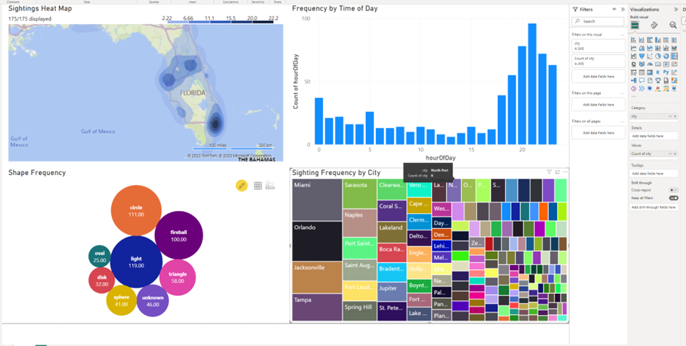

This Post was posted on the [Microsoft Tech Community Blog](https://techcommunity.microsoft.com/t5/analytics-on-azure-blog/how-to-use-redis-as-a-data-source-for-power-bi-with-redis-sql/ba-p/3799471).